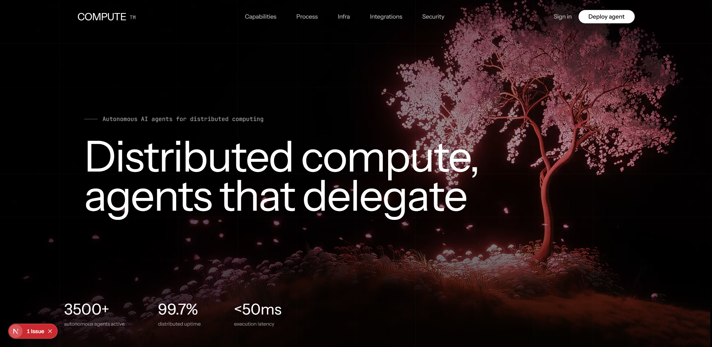

# COMPUTE — Premium AI Agent Landing Page



**COMPUTE** is a high-performance, cinematic landing page concept designed for an AI agent platform. This project showcases modern web design, smooth momentum scrolling, and a premium developer aesthetic.

## ✨ Features

- **Distributed Orchestration**: Deploy agents across global infrastructure with ease.
- **Autonomous Workflows**: Offload complex tasks to intelligent workers that run 24/7.
- **Premium Aesthetics**: A stunning, dark-mode interface designed for modern engineering teams.
- **Smooth Momentum Scrolling**: Integrated with [Lenis](https://lenis.darkroom.engineering/) for a fluid, high-end "gliding" feel.
- **Responsive & Accessible**: Optimized for all devices and built with accessible UI components.

## 🚀 Tech Stack

- **Framework**: [Next.js 15+](https://nextjs.org/) (App Router)
- **Styling**: [Tailwind CSS 4](https://tailwindcss.com/)
- **Components**: [Radix UI](https://www.radix-ui.com/) & [Shadcn UI](https://ui.shadcn.com/)
- **Icons**: [Lucide React](https://lucide.dev/)
- **Animations**: [Lenis Smooth Scroll](https://github.com/darkroomengineering/lenis) & Framer Motion
- **Fonts**: [Instrument Sans](https://fonts.google.com/specimen/Instrument+Sans) & [JetBrains Mono](https://www.jetbrains.com/lp/mono/)

## 🛠️ Getting Started

### Prerequisites

- Node.js 18+
- pnpm (recommended)

### Installation

1. Clone the repository:
   ```bash
   git clone https://github.com/kuruminyx/Compute-Landing-Page.git
   cd Compute-Landing-Page
   ```

2. Install dependencies:
   ```bash
   pnpm install
   ```

3. Run the development server:
   ```bash
   pnpm dev
   ```

4. Open [http://localhost:3000](http://localhost:3000) in your browser.

## 📄 License

This project is licensed under the MIT License - see the [LICENSE](LICENSE) file for details.

---

Built with precision by [kuruminyx](https://github.com/kuruminyx).
